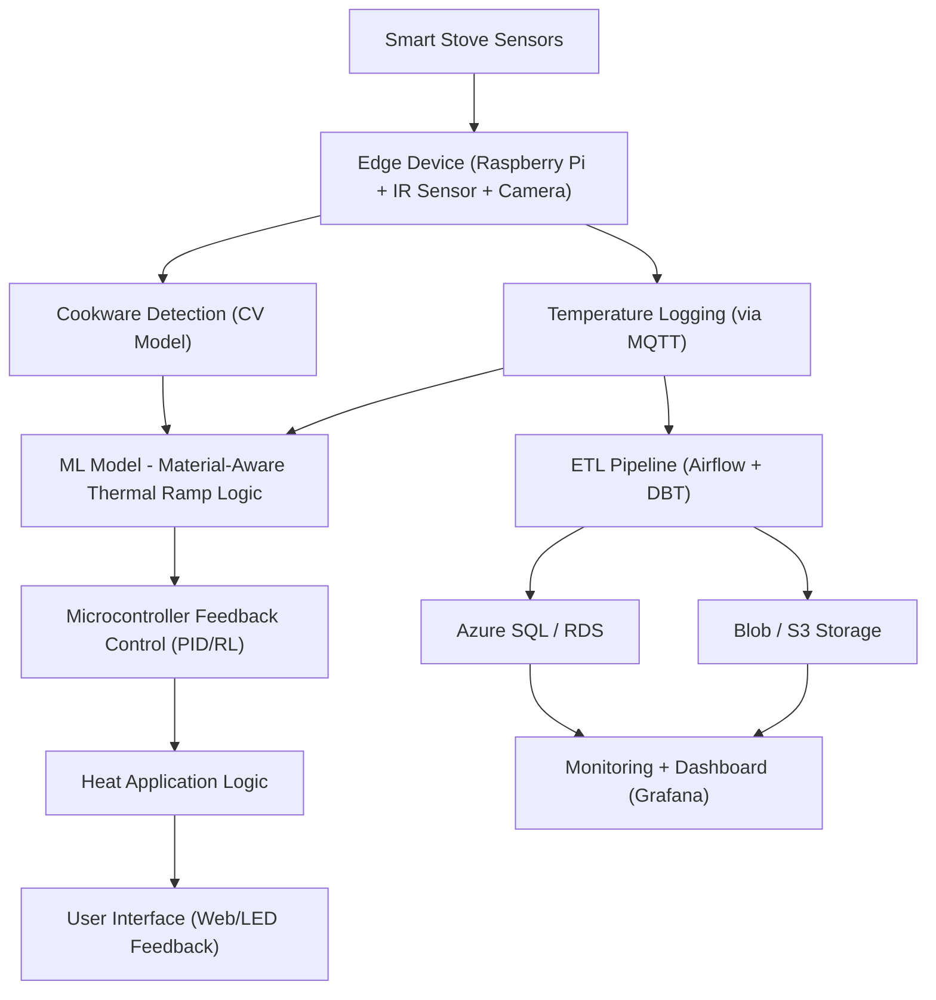

# 🔥 ThermaSafeAI: Smart Stove Safety via AI & IoT


---

## 🧭 Project Overview

**ThermaSafeAI** is an AI-powered stovetop safety system designed to protect sensitive cookware like Pyrex from shattering due to thermal shock. By integrating IoT sensors, AI-driven heat control algorithms, and real-time monitoring, this solution helps ensure safe and efficient cooking for all households.

---

## 🗺️ System Architecture



---

## 🧰 Tech Stack

### 🔧 Backend & Infrastructure  
  
  
  
  


---

### 🤖 AI / Machine Learning  
  
  
  


---

### 🌡️ Sensors & Edge  
  


---

### 📊 Data Orchestration  
  


---

### 🎨 User Interface  
  
  


---

### 🚀 DevOps  
  
  


---

## 🗃️ Folder Structure

```bash
ThermaSafeAI/
├── data/                  # Raw and processed sensor data
├── scripts/               # ML training, inference scripts
├── models/                # Trained AI models
├── notebooks/             # Jupyter exploration
├── infra/                 # Terraform scripts, Dockerfiles
├── etl/                   # Airflow/DBT ETL pipelines
├── dashboard/             # Streamlit dashboard code
└── .github/workflows/     # GitHub CI/CD YAML configs
```

---

## 🧠 Core Features

- 📸 **Cookware Detection**: Uses OpenCV to identify cookware and materials
- 🌡️ **Heat Prediction Model**: ML-based ramp rate logic to reduce thermal stress
- 🔄 **PID + RL Feedback Loop**: Smart control of burners based on cookware material
- 📊 **Real-time Monitoring**: Dashboards for thermal trends and heat anomalies
- ⚠️ **Risk Alerts**: Notifies user of unsafe heating patterns

---

## 🧪 Example SQL Tables

```sql
CREATE TABLE cookware_events (
    id SERIAL PRIMARY KEY,
    cookware_type VARCHAR(50),
    material VARCHAR(50),
    detection_confidence FLOAT,
    timestamp TIMESTAMP DEFAULT CURRENT_TIMESTAMP
);

CREATE TABLE temp_ramp_logs (
    id SERIAL PRIMARY KEY,
    cookware_id INT REFERENCES cookware_events(id),
    surface_temp FLOAT,
    ambient_temp FLOAT,
    heating_state VARCHAR(20),
    ramp_rate FLOAT,
    risk_flag BOOLEAN,
    timestamp TIMESTAMP DEFAULT CURRENT_TIMESTAMP
);
```

---

## 🛠️ Local Setup

```bash
git clone https://github.com/yourusername/ThermaSafeAI.git
cd ThermaSafeAI
python -m venv venv
source venv/bin/activate
pip install -r requirements.txt
```

---

## 🚦 GitHub CI Workflow (./github/workflows/ci.yml)

```yaml
name: CI Pipeline

on: [push, pull_request]

jobs:
  build-and-test:
    runs-on: ubuntu-latest
    steps:
      - uses: actions/checkout@v3
      - name: Set up Python
        uses: actions/setup-python@v4
        with:
          python-version: 3.10
      - name: Install dependencies
        run: |
          pip install -r requirements.txt
      - name: Run Unit Tests
        run: |
          pytest tests/
```
Absolutely! Below is a **GitHub README section** written in a clean and professional tone — tailored as if you're a **Product Manager** giving Git instructions and push guidelines to team members. It includes common push commands, how to trigger CI/CD GitHub Actions, and how to handle pull requests responsibly.

---

### 🚀 Git Push & GitHub Actions (PM Guidelines)


To maintain project integrity and enable automated workflows for **ThermaSafeAI**, follow these steps when making contributions.

#### 🔄 1. Sync Your Local Branch

```bash
git checkout main
git pull origin main
```

✅ *Ensure your branch is up to date before making changes.*

#### 🛠️ 2. Stage and Commit Changes

```bash
git add .
git commit -m "Brief, clear message about what was changed"
```

📝 *Use commit messages that clearly explain **what** and **why** the change was made.*

#### 📤 3. Push and Trigger CI/CD Workflow

```bash
git push origin main
```

📡 *This automatically triggers GitHub Actions to run our `test-ci.yml` workflow.*

#### 🔀 4. Working with Feature Branches

```bash
git checkout -b feature/your-branch-name
# Make changes...
git add .
git commit -m "Add new feature XYZ"
git push origin feature/your-branch-name
```

Then, go to [Pull Requests](https://github.com/emcdo411/thermasafe-ai/pulls) and **open a new PR**.

🧪 *CI will auto-test your branch. Only merge to `main` if tests pass.*

---

### ✅ PR Approval Checklist (for Maintainers)

Before approving or merging any pull request:

* [ ] CI/CD pipeline passes (✅ green check)
* [ ] Code is modular and matches directory structure
* [ ] Naming conventions are consistent
* [ ] Sensitive credentials/secrets are not exposed
* [ ] SQL logic is safe and well-commented
* [ ] Streamlit/UI code renders correctly (if applicable)

---

Let me know if you want a badge at the top that shows build status (e.g., "Build: Passing ✅") or want to add a deployment workflow next!

---

## 📈 Dashboard Example (Mock)

- Thermographic heat maps from IR sensors
- Safe/Unsafe thresholds highlighted in red
- Streamlit widgets for burner control simulation

---

## 🤝 Contributors

**Erwin Maurice McDonald** – Project Lead, AI Strategist, Solutions Architect  
**Stakeholder Team** – Advisory and Industrial Safety Oversight

---

## 💡 Why This Matters

Each year, dozens of kitchen accidents occur due to thermal shock. Most are preventable. This project brings together AI, IoT, and real-time control systems to deliver **safer, smarter kitchens** with industrial-grade tech.

---

## 📬 Contact

For collaboration or inquiries, contact: [moe.mcdonald@gmail.com](mailto:moe.mcdonald@gmail.com)

---

*Built with ❤️ by a veteran innovator exploring the edge of AI, safety, and hardware.*


